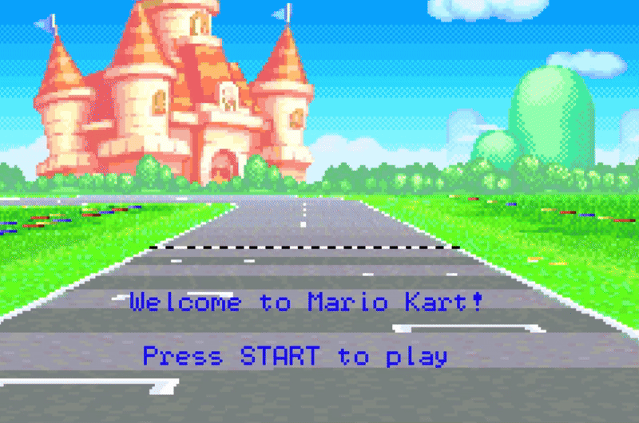
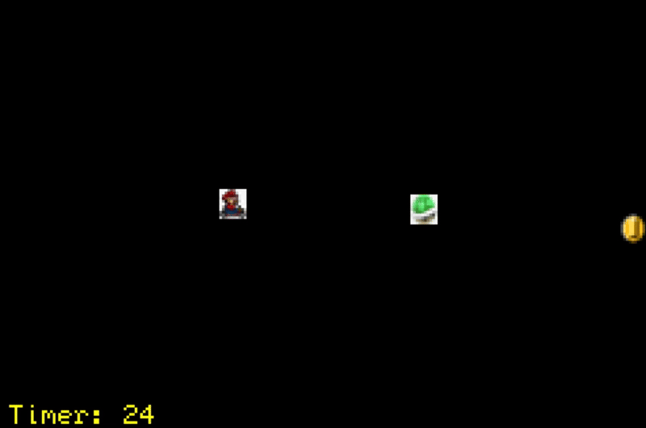

## Gameboy Advance Game
This project was created as an assignment for **CS 2110 - Computer Organization** (Spring 2023) at Georgia Tech.

## How the Game Works 
- The goal is for the player (**Mario**) to move from one end of the screen to the other to reach the gold coin.
- The game starts with **30 seconds**, counting down over time.
- A **flying green turtle shell** moves randomly across the screen.
- If **Mario** collides with the **turtle shell**, **the player loses.**
- If **Mario** collects the **gold coin**, **the player wins.**
- If the timer reaches **0**, **the player loses.**

## How to Play
- Press **'Enter'** to start the game from the welcome screen.
- Control **Mario**'s movement using the arrow keys: **up, down, left, right.**
- Press **'Backspace'** to restart the game anytime.

## Gameplay Demo
### Win Scenario
Mario reaches the gold coin before the time runs out.

### Lose Scenario
Mario collides with the turtle shell or time runs out.

## Technologies Used
- **C**: Progamming language
- **mGBA**: Gameboy Advance emulator used for testing and gameplay
- **Docker**: Development environment
